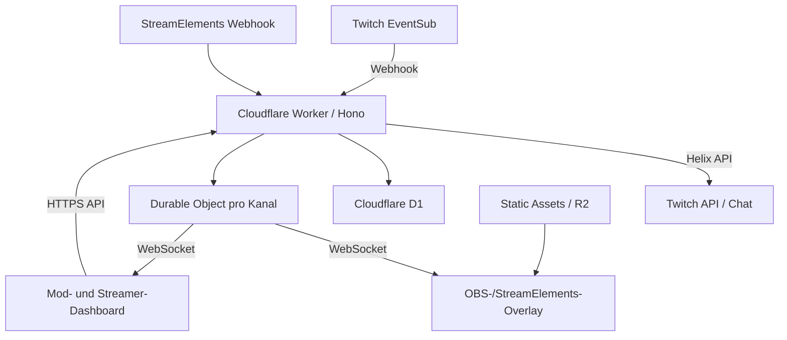

# Twitch-Bot mit Web-Overlay auf Cloudflare

## Architektur- und Stack-Entscheidung

**Stand:** 15. September 2026  
**Ziel:** Ein Twitch-Bot mit Mod-/Streamer-Dashboard und einem in OBS oder StreamElements einbindbaren Web-Overlay. Der Betrieb soll für zunächst einen Twitch-Kanal möglichst vollständig im Cloudflare-Free-Tarif möglich sein.

---

## 1. Kurzfazit

Das Vorhaben lässt sich sinnvoll auf Cloudflare betreiben, wenn der Bot nicht als klassischer dauerhaft laufender IRC-Prozess aufgebaut wird. Stattdessen sollte er ereignisorientiert arbeiten:

- Twitch EventSub liefert Ereignisse per Webhook an einen Cloudflare Worker.
- Der Worker verarbeitet Commands, Integrationen und API-Aufrufe.
- Chatnachrichten werden über die Twitch-Helix-API gesendet.
- Ein Durable Object verteilt Echtzeitereignisse per WebSocket an OBS, StreamElements und das Dashboard.
- D1 speichert Konfiguration, Commands, Rollen und Audit-Daten.
- Statische Overlay- und Dashboard-Dateien werden als Worker Static Assets ausgeliefert.
- Größere Medien wie Sounds oder Videos können in R2 liegen.

Die empfohlene technische Basis ist durchgängig **TypeScript**:

| Bereich | Empfehlung |
|---|---|
| Sprache | TypeScript |
| Runtime | Cloudflare Workers |
| Backend | Hono |
| Dashboard | React + Vite |
| Overlay | React + Vite als separate, kleine Anwendung |
| Styling | Tailwind CSS |
| UI-Komponenten | shadcn/ui + Radix UI |
| Routing | TanStack Router |
| Server-State | TanStack Query |
| Formulare | React Hook Form + Zod |
| Validierung | Zod |
| Datenbank | Cloudflare D1 |
| ORM | Drizzle ORM |
| Echtzeit | Durable Objects + WebSocket Hibernation |
| Medien | Worker Static Assets und optional R2 |
| Tests | Vitest + Playwright |
| Monorepo | pnpm Workspaces |
| Deployment | Wrangler |
| CI/CD | GitHub Actions |

---

## 2. Zielarchitektur



### Grundprinzip

Der Cloudflare Worker ist kein dauerhaft laufender Botprozess. Er wird nur aktiv, wenn ein Ereignis eintrifft:

1. Twitch sendet ein EventSub-Ereignis.
2. Der Worker prüft Signatur, Event-ID und Inhalt.
3. Die fachliche Bot-Logik entscheidet über die Reaktion.
4. Der Worker sendet bei Bedarf eine Chatantwort über Helix.
5. Sichtbare Ereignisse werden an das Durable Object des Kanals übergeben.
6. Das Durable Object verteilt das Ereignis an verbundene Overlays und Dashboards.

Dadurch entstehen bei Inaktivität kaum laufende Kosten oder Rechenlast.

---

## 3. Warum TypeScript?

TypeScript ist für dieses System die sinnvollste Hauptsprache, weil Frontend, Backend, Overlay, API-Verträge und Tests dieselben Typen verwenden können.

Beispiel für ein gemeinsames Overlay-Ereignis:

```ts
export type OverlayEvent =
  | {
      type: "follow";
      eventId: string;
      userName: string;
    }
  | {
      type: "subscription";
      eventId: string;
      userName: string;
      tier: "1000" | "2000" | "3000";
      months: number;
    }
  | {
      type: "tip";
      eventId: string;
      userName: string;
      amount: number;
      currency: string;
      message?: string;
    }
  | {
      type: "command";
      eventId: string;
      command: string;
      arguments: string[];
    };
```

Der Worker erzeugt dieses Objekt, das Durable Object transportiert es und das Overlay rendert es. Das reduziert doppelte Datenmodelle und Übersetzungsfehler.

### Warum nicht primär C#, Python oder Rust?

- **C#** wäre für einen klassischen Dienst sehr gut, passt aber nicht so direkt in die Cloudflare-Workers-Runtime.
- **Python** ist für Hilfsprogramme und Analysen gut, würde hier aber zu getrennten Frontend- und Backend-Modellen führen.
- **Rust** wäre leistungsfähig, erhöht aber Entwicklungsaufwand und Komplexität ohne relevanten Nutzen für den erwarteten Traffic.
- **TypeScript** passt nativ zu Workers, Browsern, Vite, React, WebSockets und den Twitch-Web-APIs.

---

## 4. Backend: Cloudflare Worker mit Hono

Hono ist ein leichtgewichtiges Webframework, das sehr gut zur Workers-Runtime passt. Es übernimmt Routing, Middleware, Fehlerbehandlung, Cookies, CORS und Validierungsintegration, ohne die Node-lastige Architektur von Express oder NestJS mitzubringen.

### Vorgesehene Endpunkte

```text
/api/auth/twitch/login
/api/auth/twitch/callback
/api/twitch/eventsub
/api/integrations/streamelements
/api/channels/:channelId/commands
/api/channels/:channelId/settings
/api/channels/:channelId/overlay-tokens  (präzisiert mit #20 — Ausgabe-Route)
/api/channels/:channelId/test-event
/realtime/:channelId
```

### Nicht empfohlen

| Technologie | Begründung |
|---|---|
| Express | stark Node-zentriert und für Workers unnötig |
| NestJS | für diesen Umfang zu schwer und abstrakt |
| Next.js | mehr Rendering- und Deployment-Komplexität als benötigt |
| GraphQL | zusätzlicher Layer ohne konkreten Vorteil |
| Microservices | für einen oder wenige Kanäle unnötige Betriebs- und Fehlerkomplexität |

Ein modularer Worker ist zunächst die bessere Lösung als mehrere getrennte Services.

---

## 5. Twitch-Anbindung

### EventSub statt dauerhaftem IRC-Bot

Der Bot sollte Twitch-Ereignisse über EventSub-Webhooks empfangen. Das ist für serverlose Systeme geeigneter als eine permanent offene IRC- oder EventSub-WebSocket-Verbindung zu Twitch.

```text
Chatnachricht bei Twitch
        ↓
EventSub: channel.chat.message
        ↓
POST /api/twitch/eventsub
        ↓
Command-Erkennung und Berechtigungsprüfung
        ↓
POST /helix/chat/messages
        ↓
Antwort erscheint im Twitch-Chat
```

### Kleine eigene Twitch-Client-Schicht

Statt einer großen Bot-Bibliothek sollte eine kleine interne Twitch-Schicht gebaut werden. Benötigt werden voraussichtlich nur:

- EventSub-Subscriptions erstellen, auflisten und löschen
- Chatnachrichten senden
- Benutzerinformationen abrufen
- Streamstatus abrufen
- OAuth-Tokens validieren und erneuern
- Channel-Informationen ändern
- erlaubte Moderationsaktionen ausführen
- Channel-Point- und weitere EventSub-Ereignisse verarbeiten

Direkte `fetch()`-Aufrufe plus Zod-Validierung sind unter Workers transparent und gut testbar.

### Wann IRC doch sinnvoll wäre

IRC sollte nur ergänzt werden, wenn eine benötigte Chatfunktion durch EventSub und Helix tatsächlich nicht verfügbar ist. Ein vorhandener `tmi.js`-Bot lässt sich nicht ohne Weiteres sinnvoll in einen normalen Worker umwandeln.

---

## 6. Dashboard

Das Mod- und Streamer-Dashboard sollte mit React und Vite gebaut werden.

### Vorgesehene Bereiche

```text
Übersicht
├── Bot-Status
├── Stream-Status
├── letzte Ereignisse
└── aktive Overlays

Commands
├── Textantworten
├── Berechtigungen
├── Cooldowns
├── Aliase
└── Overlay-Aktionen

Overlay
├── Szenen
├── Position und Größe
├── Farben und Fonts
├── Animationen
├── Sound
└── Test-Buttons

Integrationen
├── Twitch
├── StreamElements
└── weitere Webhooks

Benutzer
├── Broadcaster
├── Editors
├── Mods
└── eigene Rollen

System
├── EventSub-Status
├── Token-Status
├── Fehler
└── Audit-Log
```

### UI-Stack

- **Tailwind CSS** für konsistente Gestaltung
- **shadcn/ui** für lokal anpassbare Komponenten
- **Radix UI** für zugängliche Dialoge, Menüs und Eingabeelemente
- **Lucide Icons** für eine einheitliche Iconsprache
- **Sonner** für kompakte Toast-Meldungen
- **Motion** für gezielte Übergänge und Animationen
- **Recharts** nur dann, wenn später echte Statistiken benötigt werden

### Gestaltungsprinzipien

- dunkle, klare Oberfläche
- wenige und verständliche Hauptaktionen
- große Testschaltflächen für Overlays
- technische Twitch-Begriffe nur dort, wo sie wirklich helfen
- Grün nur für einen tatsächlich gesunden Zustand
- Gelb für Warnungen oder bevorstehende Token-Probleme
- Rot ausschließlich für Fehler und kritische Aktionen
- kritische Aktionen mit Bestätigung und Audit-Eintrag

---

## 7. Overlay

Das Overlay sollte eine eigene kleine Vite-Anwendung sein. Es kann React verwenden, darf aber nicht den gesamten Dashboard-Code laden.

### Aufgaben des Overlays

- WebSocket-Verbindung herstellen
- Verbindung automatisch wiederherstellen
- Overlay-Ereignisse puffern
- Animationen nacheinander abspielen
- Sounds zuverlässig abspielen
- transparenten Hintergrund bereitstellen
- verschiedene Szenen oder Layouts unterstützen
- optional ein lokales Debug-Panel anbieten

### Grundlegendes CSS

```css
html,
body,
#root {
  width: 100%;
  height: 100%;
  margin: 0;
  overflow: hidden;
  background: transparent;
}
```

### OBS

Die bevorzugte Einbindung ist eine direkte Browserquelle:

```text
https://bot.example.de/overlay#token=...
```

Die Beispiel-URL wurde mit #20 präzisiert: Das technische Overlay-Token liegt
im Fragment der festen Overlay-Datei, nicht in einem veralteten Kanalpfad mit
Query-Schlüssel. Mit der Pfadkorrektur vom 2026-09-18 verwendet die
ausgelieferte URL nun `/overlay` statt des zuvor dokumentierten
`/overlay.html`; lokal unter Vite bleibt `/overlay.html` der HTML-Einstieg.

Wichtige Eigenschaften:

- Referenzauflösung 1920 × 1080
- responsive Skalierung
- kein Scrollen
- transparente Seite
- Cache-Busting bei Releases
- Wiederverbindung nach Netzwerkunterbrechungen
- kontrollierte Event-Warteschlange
- keine Twitch- oder OAuth-Tokens in der URL

### StreamElements

Eine Einbindung per iframe ist grundsätzlich möglich:

```html
<iframe
  src="https://bot.example.de/overlay#token=..."
  style="position:absolute;width:100%;height:100%;border:0">
</iframe>
```

Auch das iframe-Beispiel ist mit #20 auf die tatsächliche Fragment-Form
präzisiert. Mit der Pfadkorrektur vom 2026-09-18 wurde der ausgelieferte Pfad
von `/overlay.html` auf `/overlay` korrigiert; der Klartext-Token wird weiterhin
nur einmal aus der Ausgabe-Route übernommen.

Die direkte OBS-Browserquelle ist dennoch zu bevorzugen. Bei StreamElements können iframe-Sandboxing, Content-Security-Policy und Audio-Autoplay zusätzliche Fehlerquellen erzeugen.

### Animationen

Für den Anfang reichen CSS-Animationen und Motion. GSAP sollte erst ergänzt werden, wenn komplexe, exakt getaktete Szenen entstehen. Eine zusätzliche Animationsbibliothek ohne konkreten Bedarf wäre unnötige Komplexität.

---

## 8. Echtzeitkommunikation

Für jeden Twitch-Kanal sollte ein Durable Object als zentraler Echtzeitraum dienen:

```text
channel-room:489111423
```

Es verwaltet:

- verbundene OBS-Overlays
- geöffnete Dashboards
- WebSocket-Heartbeats
- Wiederverbindungen
- Overlay-Ereigniswarteschlangen
- Event-Bestätigungen
- kurzfristigen aktiven Zustand
- optional die Wiederholung noch nicht angezeigter Ereignisse

### Versioniertes Protokoll

```ts
type RealtimeMessage =
  | {
      version: 1;
      type: "overlay.event";
      payload: OverlayEvent;
    }
  | {
      version: 1;
      type: "overlay.reload";
    }
  | {
      version: 1;
      type: "config.changed";
    }
  | {
      version: 1;
      type: "heartbeat";
    };
```

WebSocket Hibernation ist wichtig, damit die Verbindung bestehen kann, ohne dass das Durable Object permanent CPU-Zeit verbraucht.

### Alternative für einen sehr kleinen Prototyp

Ein Overlay könnte alle zwei bis fünf Sekunden pollen. Das ist für einen ersten technischen Prototyp einfach, skaliert aber schlechter und reagiert verzögert. Für ein ernsthaft genutztes Overlay sind Durable Objects und WebSockets die bessere Zielarchitektur.

---

## 9. Datenhaltung

### D1 und Drizzle ORM

D1 speichert strukturierte und dauerhaft benötigte Daten. Drizzle ORM bietet TypeScript-Typen und Migrationen, ohne SQL zu verstecken.

Vorgesehene Tabellen:

```text
users
channels
channel_members
twitch_connections
commands
command_aliases
command_permissions
overlay_configs
overlay_tokens
integrations
event_receipts
audit_log
```

### Geeignete Zuordnung

| Inhalt | Speicher |
|---|---|
| Bot- und Overlay-Konfiguration | D1 |
| Commands, Aliase und Cooldowns | D1 |
| Rollen und Berechtigungen | D1 |
| OAuth-Verbindungsmetadaten | D1 |
| Event-Deduplizierung | D1 oder Durable Object Storage |
| aktueller Overlay-Zustand | Durable Object |
| kleine statische Dateien | Worker Static Assets |
| größere Sounds, Videos und Benutzerdateien | R2 |
| umfangreiche Chatarchive | komprimiert in R2, nicht zeilenweise in D1 |

KV sollte nicht als Hauptdatenbank für häufig geänderte Counter verwendet werden. Die Schreiblimits und eventual consistency sind dafür weniger geeignet.

---

## 10. Frontend-Datenfluss

### TanStack Router

TanStack Router ermöglicht typsichere Routen und Parameter, beispielsweise:

```text
/channels/:channelId/commands
/channels/:channelId/overlay
/channels/:channelId/integrations
```

React Router wäre ebenfalls vertretbar. TanStack Router bietet bei einem wachsenden Dashboard mehr Typsicherheit.

### TanStack Query

TanStack Query verwaltet Serverdaten wie Commands, Einstellungen und Statusinformationen. WebSocket-Nachrichten sollten möglichst nicht den vollständigen Datenbestand transportieren.

Beispiel:

```text
WebSocket meldet: command.updated
        ↓
TanStack Query invalidiert die Commands-Abfrage
        ↓
Dashboard lädt den autoritativen Stand über die API
```

### Zustand

Zustand kann optional für reinen UI-Zustand eingesetzt werden:

- aktuell ausgewählter Kanal
- geöffnete Seitenleiste
- Auswahl im Overlay-Editor
- lokale Vorschau
- noch nicht gespeicherte Layoutänderungen

Serverdaten gehören weiterhin in TanStack Query.

---

## 11. Validierung und gemeinsame Verträge

Ein gemeinsames Package enthält API-, Daten- und Eventverträge:

```text
packages/contracts
├── api.ts
├── commands.ts
├── overlay-events.ts
├── permissions.ts
└── twitch-events.ts
```

Zod-Schemas können gleichzeitig im Dashboard und im Worker verwendet werden:

```ts
export const commandSchema = z.object({
  name: z.string().regex(/^[a-z0-9_]+$/),
  response: z.string().min(1).max(500),
  cooldownSeconds: z.number().int().min(0).max(3600),
  access: z.enum(["everyone", "subscriber", "vip", "moderator"]),
});
```

Das Schema dient dann für:

- Dashboard-Formulare
- API-Eingaben
- Worker-Validierung
- Tests
- optional generierte OpenAPI-Dokumentation

---

## 12. Authentifizierung und Berechtigungen

Das Dashboard verwendet Twitch OAuth:

```text
Benutzer öffnet Dashboard
        ↓
Login mit Twitch
        ↓
OAuth-Callback im Worker
        ↓
Twitch-Benutzer-ID und Scopes prüfen
        ↓
Kanalrolle oder interne Rolle ermitteln
        ↓
verschlüsselte HttpOnly-Session erzeugen
```

Wichtig ist die Trennung:

- **Authentifizierung:** Wer ist der Benutzer?
- **Autorisierung:** Welche Aktion darf der Benutzer in welchem Kanal ausführen?

Das Dashboard darf eine Moderator- oder Editor-Rolle nicht lediglich aus dem Frontend übernehmen. Jede schreibende Aktion wird im Worker erneut geprüft.

### Zugriffsebenen

```text
/overlay#token=... → langes, widerrufbares Overlay-Token im Fragment
/dashboard              → Twitch OAuth und Rollenprüfung
/api/twitch/eventsub    → Twitch-HMAC-Signaturprüfung
```

Die Zugriffsebenen-Zeile wurde mit der Pfadkorrektur vom 2026-09-18 von
`/overlay.html` auf den kanonischen Auslieferungspfad `/overlay` aktualisiert.

### Sicherheitsanforderungen

- Twitch-Webhook-Signaturen prüfen
- Event-ID zur Deduplizierung speichern
- OAuth- und Refresh-Tokens verschlüsseln
- Tokens niemals in Local Storage ablegen
- OAuth- und Twitch-Tokens niemals in Overlay-URLs übertragen; der
  technische Overlay-Zugang wird als eigener Token im URL-Fragment geführt
  (präzisiert mit #20 — ursprünglich stand hier pauschal „Tokens niemals in
  Overlay-URLs", gemeint waren OAuth- und Twitch-Tokens. Begründung der
  Fragment-Wahl in `docs/ARCHITECTURE.md`)
- Sessions als Secure-, HttpOnly- und SameSite-Cookies
- CSRF-Schutz für schreibende Dashboard-Aktionen
- Rate Limits pro Kanal, Benutzer und Command
- Overlay-Schlüssel einzeln widerrufbar machen
- Audit-Log für administrative Änderungen
- Twitch-, Bot- und Broadcaster-Berechtigungen sauber trennen

---

## 13. Fachliche Bot-Logik isolieren

Die eigentliche Command- und Regelverarbeitung sollte weder Twitch noch Cloudflare direkt kennen.

```ts
const result = executeCommand({
  command,
  sender,
  channel,
  currentTime,
});
```

Das Ergebnis beschreibt nur gewünschte Aktionen:

```ts
{
  chatMessages: [],
  overlayEvents: [],
  stateChanges: []
}
```

Erst der Worker führt diese Aktionen über Twitch, D1 oder Durable Objects aus. Dadurch kann die Kernlogik ohne Netzwerk und Cloudflare-Runtime getestet werden.

---

## 14. Fehlerbehandlung und Zuverlässigkeit

### EventSub

- Signatur und Zeitstempel vor Verarbeitung prüfen
- Event-ID deduplizieren
- Webhook schnell bestätigen
- aufwendigere Folgeaktionen entkoppeln
- fehlgeschlagene Twitch-Aufrufe mit begrenztem Retry behandeln
- keine unbegrenzten Retry-Schleifen

### Overlay

- WebSocket mit exponentiellem Backoff wiederverbinden
- Status `connected`, `reconnecting` und `offline` intern unterscheiden
- Ereignisse mit eindeutiger ID versehen
- doppelte Ereignisse nicht erneut anzeigen
- maximale Queue-Größe definieren
- alte Ereignisse nach Zeitablauf verwerfen
- Audiofehler dürfen die visuelle Animation nicht blockieren

### Twitch-Tokens

- Ablaufzeit speichern
- vor Ablauf kontrolliert erneuern
- Refresh-Fehler sichtbar im Dashboard anzeigen
- bei widerrufener Autorisierung keine Endlosschleifen erzeugen
- erneute Verbindung durch den Broadcaster ermöglichen

---

## 15. Tests

### Unit-Tests mit Vitest

- Command-Parsing
- Berechtigungen
- Cooldowns
- Aliase
- Event-Transformation
- Twitch-Signaturprüfung
- Deduplizierung
- Token-Verschlüsselung
- Overlay-Queue

### Worker-Integrationstests

- Hono-Routen
- D1-Zugriffe und Migrationen
- Durable Objects
- WebSocket-Nachrichten
- EventSub-Verifikation
- OAuth-Callback
- Fehler- und Retry-Verhalten

### End-to-End-Tests mit Playwright

- Login mit gemocktem Twitch-Provider
- Command im Dashboard anlegen
- Test-Alert auslösen
- Alert erscheint im Overlay
- Overlay in 1920 × 1080 korrekt darstellen
- transparenter Hintergrund
- Wiederverbindung nach WebSocket-Abbruch
- iframe-Modus für StreamElements
- Screenshot-Tests für wichtige Overlay-Zustände

Screenshot-Tests sind besonders wichtig, weil funktional korrekter Code trotzdem abgeschnittene Texte oder falsch positionierte Animationen erzeugen kann.

---

## 16. Repository-Struktur

Empfohlen wird ein pnpm-Monorepo:

```text
brobot/
├── apps/
│   ├── worker/
│   │   ├── src/
│   │   │   ├── routes/
│   │   │   ├── services/
│   │   │   ├── durable-objects/
│   │   │   └── index.ts
│   │   └── wrangler.jsonc
│   ├── dashboard/
│   │   └── src/
│   └── overlay/
│       └── src/
├── packages/
│   ├── contracts/
│   ├── database/
│   ├── twitch/
│   ├── bot-core/
│   ├── ui/
│   └── test-utils/
├── migrations/
├── tests/
├── package.json
└── pnpm-workspace.yaml
```

### Paketmanager und Runtime

```text
Paketmanager: pnpm
lokale Build-Runtime: aktuelle Node.js-LTS-Version
Produktions-Runtime: Cloudflare Workers
Test Runner: Vitest
Browser-Tests: Playwright
Deployment: Wrangler
```

Bun wäre technisch möglich, bringt aber für dieses Projekt keinen entscheidenden Vorteil. Die Produktionsruntime ist ohnehin Cloudflare Workers.

---

## 17. Cloudflare-Free-Eignung

Der Free-Tarif ist für einen einzelnen Kanal realistisch, sofern folgende Regeln eingehalten werden:

- EventSub-Webhooks statt eines dauerhaft laufenden Twitch-Prozesses
- WebSocket Hibernation für Overlay-Verbindungen
- statische Medien über Static Assets oder R2
- keine Speicherung jeder Chatnachricht als einzelne D1-Zeile
- keine rechenintensive Video-, Bild- oder TTS-Erzeugung im Worker
- begrenzte Anzahl paralleler Overlays und Dashboards
- effiziente D1-Abfragen und Event-Deduplizierung
- Polling vermeiden oder zumindest langsam und kontrolliert einsetzen

### Problematische Aufgaben

- ffmpeg oder Videobearbeitung
- lokale Dateisystemabhängigkeiten
- lang laufende Schleifen
- beliebige Node-Socket-Bibliotheken
- dauerhaftes Audio-Mixing
- rechenintensive lokale TTS-Erzeugung
- Headless-Browser-Automatisierung
- vollständige Chatarchivierung in D1

Solche Aufgaben müssten später in einen separaten Dienst oder auf vorhandene Infrastruktur ausgelagert werden.

---

## 18. Sinnvoller MVP

Der erste produktive Stand sollte bewusst klein bleiben.

### MVP-Funktionen

1. Twitch-OAuth für Broadcaster und Mods
2. EventSub für Chatnachrichten und ausgewählte Kanalereignisse
3. einfache Textcommands mit Rollen und Cooldowns
4. Senden von Chatantworten über Helix
5. ein Durable Object pro Kanal
6. ein OBS-Overlay mit WebSocket-Wiederverbindung
7. Test-Alert aus dem Dashboard
8. D1 für Commands, Einstellungen und Deduplizierung
9. Audit-Log für Konfigurationsänderungen
10. Vitest- und Playwright-Grundtests

### Bewusst nicht im ersten MVP

- visueller Drag-and-drop-Overlay-Editor
- TTS-Erzeugung
- komplexe Szenen-Engine
- vollständige Twitch-Moderationssuite
- Multi-Tenant-Abrechnung
- Plugin-System
- umfangreiche Chatstatistik
- eigener Video-Renderer

Diese Funktionen können später ergänzt werden, sobald der grundlegende Eventfluss im echten Stream stabil läuft.

---

## 19. Offene Architekturentscheidung

Vor dem endgültigen Datenmodell muss entschieden werden, ob das System:

1. ausschließlich für einen einzelnen Kanal gebaut wird oder
2. von Anfang an mehrere selbstständig angemeldete Twitch-Kanäle unterstützt.

### Einzelkanal

Vorteile:

- schnellerer MVP
- einfachere Rollen und OAuth-Flows
- weniger Verwaltungsoberfläche
- geringere Fehler- und Sicherheitsfläche

### Mehrkanal-/SaaS-fähig

Zusätzlich erforderlich:

- konsequente Mandantentrennung
- Onboarding neuer Broadcaster
- kanalspezifische OAuth-Verbindungen
- Quoten und Limits pro Kanal
- Datenexport und Löschung pro Mandant
- Kanalbesitzer- und Teamverwaltung
- möglicherweise Tarif- und Abrechnungslogik

### Empfehlung

Die interne Datenstruktur sollte bereits eine `channelId` als Mandantenschlüssel verwenden. Das erste Produkt sollte funktional trotzdem auf einen einzelnen Kanal begrenzt werden. Dadurch bleibt der MVP überschaubar, ohne eine spätere Mehrkanalfähigkeit unnötig zu verbauen.

---

## 20. Endgültige Empfehlung

```text
TypeScript
├── Cloudflare Worker
│   ├── Hono
│   ├── Zod
│   ├── Drizzle
│   ├── D1
│   ├── Durable Objects
│   ├── R2
│   └── Twitch EventSub + Helix
│
├── React Dashboard
│   ├── Vite
│   ├── TanStack Router
│   ├── TanStack Query
│   ├── React Hook Form
│   ├── Tailwind CSS
│   └── shadcn/ui
│
└── React Overlay
    ├── Vite
    ├── WebSocket Client
    ├── CSS-/Motion-Animationen
    └── transparente OBS-Ausgabe
```

Dieser Stack ist modern, aber nicht unnötig experimentell. Er nutzt Cloudflares Stärken, hält den Free-Betrieb für einen Kanal realistisch und erlaubt spätere Erweiterungen um StreamElements, Channel Points, TTS, Soundboards, Ziele, Statistiken und weitergehende Mod-Funktionen.
